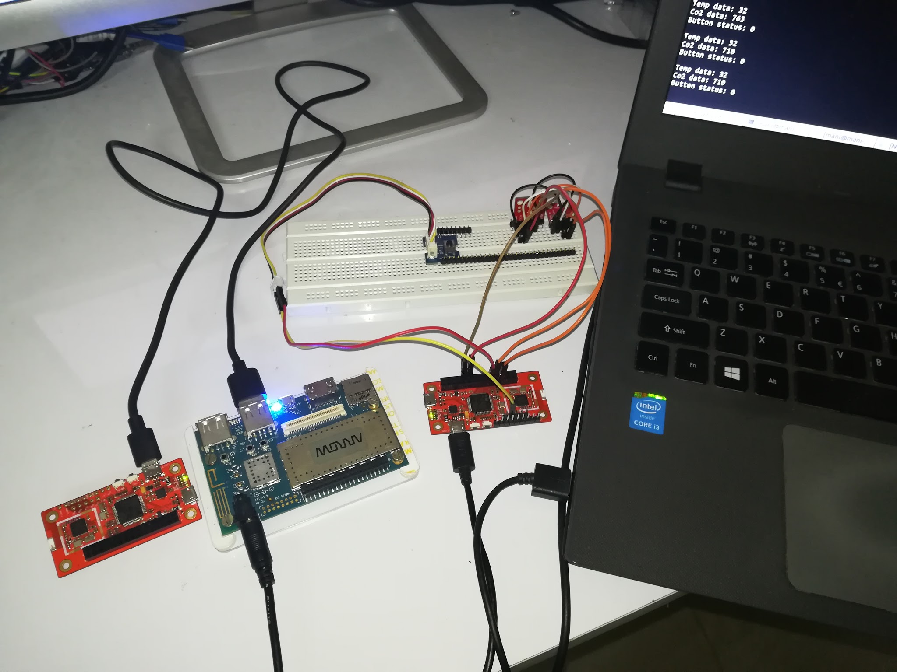
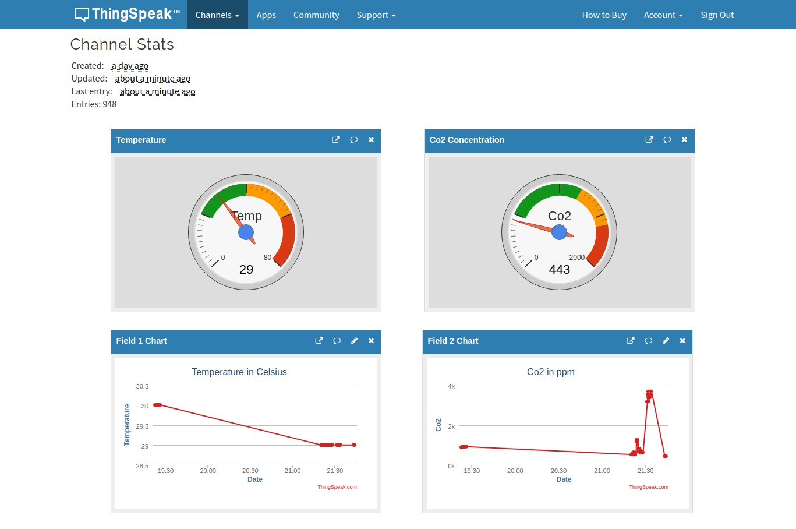

---
# Front Matter
# Title of your project used for the breadcrumb title and meta title.
title:  Patient Monitoring System using 96Boards

# Permalink your project will reside under on the 96boards.org website.
# separate your title's words with dashes for SEO purposes.
permalink: /projects/patient-monitoring-system-using-96boards/
#author: 96Boards

# Add a description of your project
description: This repository consists of instructions to set up a Patient Monitoring Systems using 96Boards with the help of BLE Mesh network.

# Add the names of your images which are stored in the sub folders here.
# The first image is always used in the table at /projects/
# This section is used to add a social media share image to your project.
# Place the image you'd like to use when sharing on social media in the /assets/images/projects/
# folder and adjust the following YAML accordingly.
# High Res 1920 x 1080
# regenerated on site build
#image: 
#    path: /assets/images/projects/share_image.png
#    list:
#        - thumb.png
#        - share.png
#social:
#  name: 96Boards
#  links:
#    - https://twitter.com/96boards
#    - https://www.facebook.com/96Boards/
#    - https://www.linkedin.com/company/96boards/
#    - https://plus.google.com/+96Boards
#    - https://github.com/96boards
project:
    # Difficulty level for your project <Beginner, Intermediate, Experienced>
#    difficulty_level:
#     - Intermediate
    # Boards that you have used in this project. For a full list of boards see 
    # this file in the 96boards/website repo - _data/boards.yml
    boards_used: 
        - dragonboard410c
        - carbon
    # Verticals are catagories that your project belongs to. For a full list of verticals see 
    # this file in the 96boards/website repo - _data/verticles.yml
    verticals:
        - Healthcare
#Optional tags for your projects: meta-key words
tags:
- dragonboard410c
- carbon
---
# Patient Monitoring System using 96Boards

This repository consists of instructions to set up a Patient Monitoring
Systems using 96Boards with the help of BLE Mesh network.

## Table of Contents
- [1) Hardware](#1-hardware)
   - [1.1) Hardware Requirements](#11-hardware-requirements)
- [2) Software Setup](#2-software-setup)
   - [2.1) Setting up the Mesh Nodes](#21-setting-up-the-mesh-nodes)
   - [2.2) Setting up the Cloud Service](#22-setting-up-the-cloud-service)
   - [2.3) Setting up the Gateway](#23-setting-up-the-gateway)
- [3) Hardware Setup](#3-hardware-setup)
- [4) Patient Monitoring System](#4-patient-monitoring-system)
- [5) Video Demonstration](#5-video-demonstration)

## 1) Hardware

### 1.1) Hardware Requirements

- [Dragonboard410c](https://www.96boards.org/product/dragonboard410c/)
- [96Boards Compliant Power Supply](http://www.96boards.org/product/power/)
- [96Bords Carbon](https://www.96boards.org/product/carbon/)
- [TMP112 Sensor](https://www.sparkfun.com/products/13314)
- [CCS811 Sensor](https://www.sparkfun.com/products/14193)
- [Push Button](https://www.seeedstudio.com/Grove-Button-p-766.html)
- Connecting wires

## 2) Software Setup

Below steps are used to setup the nodes and Gateway in BLE Mesh network. In this
project 2 Carbon boards will be used as Server nodes and one Carbon board will be
used as a Client node. Dragonboard410c will be used as a Gateway.

### 2.1) Setting up the Mesh Nodes

Following steps are used to setup the BLE Mesh nodes:

#### Programming nRF Co-Processor

[Execute this section on all Carbon boards using Host machine]

Follow the below steps to flash the **hci_spi** sample application
to the nRF co-processor on 96Boards Carbon using a Linux enabled host
machine.

First setup the development environment as mentioned [here](http://docs.zephyrproject.org/getting_started/installation_linux.html).

```shell
$ git clone https://github.com/Mani-Sadhasivam/zephyr.git
$ cd zephyr
$ git checkout ble_mesh_3
$ source zephyr-env.sh
$ samples/bluetooth/hci_spi
$ mkdir build
$ cd build
$ cmake -DBOARD=96b_carbon_nrf51 ..
$ make
```

Once the application is successfully built, flash the binary onto the
nRF chip by following this [guide](http://docs.zephyrproject.org/boards/arm/96b_carbon_nrf51/doc/96b_carbon_nrf51.html#programming-and-debugging).
Now, this chip can provide HCI interface to STM32 via SPI.

#### Programming Sensor Server application

[Execute this section on the Carbon boards to be used as Server nodes using Host machine]

Next step is to program the Sensor Server application to the STM32 chip
on the Carbon boards to act as a Sensor Servers.

Move to the top of the cloned Zephyr repository.

```shell
$ cd zephyr
$ cd samples/bluetooth/ble_mesh_srv
$ mkdir build
$ cd build
$ cmake -DBOARD=96b_carbon ..
$ make
```
> Note: You should set different `NODE_ID` in `ble_mesh_srv/src/main.c` for different
        Server nodes. For this project, it is assumed that first node contains `NODE_ID` of 1
        and second node contains `NODE_ID` of 2.

Now, the built binary can be flashed by following this [guide](http://docs.zephyrproject.org/boards/arm/96b_carbon/doc/96b_carbon.html#programming-and-debugging).
Once the application binary is flashed, connect the UART port of Carbon
board to the Host machine using USB-A to USB-B Micro cable and bring up
the serial emulation tool like minicom on the corresponding port.

After board reset you should see the below message on the serial port:

```shell
Initializing...
Bluetooth initialized
Mesh initialized
```

#### Programming Sensor Client application

[Execute this section on the Carbon board to be used as a Client node using Host machine]

As like the Sensor Server application, Sensor Client application is also
need to be programmed on another Carbon board.

Move to the top of the cloned Zephyr repository.

```shell
$ cd zephyr
$ cd samples/bluetooth/ble_mesh_cli
$ mkdir build
$ cd build
$ cmake -DBOARD=96b_carbon ..
$ make
```

Now, the built binary can be flashed by following this [guide](http://docs.zephyrproject.org/boards/arm/96b_carbon/doc/96b_carbon.html#programming-and-debugging).
Once the application binary is flashed, connect the UART port of Carbon
board to the Host machine using USB-A to USB-B Micro cable and bring up
the serial emulation tool like minicom on the corresponding port.

After board reset you should see the below message on the serial port:

```shell
Initializing...
Bluetooth initialized
Mesh initialized
```

#### Provisioning and Configuring the Nodes

[Execute this section on all Carbon boards using Host machine]

Next step is to provision and configure both the nodes to be used in BLE Mesh network.
This requires the `meshctl` utility in [Bluez](https://git.kernel.org/pub/scm/bluetooth/bluez.git) stack.
Install Bluez by following the below steps.

```shell
$ git clone https://git.kernel.org/pub/scm/bluetooth/bluez.git
$ cd bluez
$ bootstrap
$ ./configure --prefix=/usr --mandir=/usr/share/man --sysconfdir=/etc --localstatedir=/var --enable-mesh
$ make
$ sudo make install
```

Above commands will install Bluez on the host machine with BLE mesh support.

##### Server Node

[Execute the below section on the Carbon boards to be used as Server using Host machine]

Now, execute the below steps for provisioning and configuring the Server node:

```shell
$ cd bluez/mesh
$ meshctl
```
This will bring up the **meshctl** command prompt.

```shell
[meshctl]# discover-unprovisioned on
[meshctl]# provision dddd
```
Here we are provisioning the node `dddd` which is default address for all
un-provisioned nodes.

Now, enter the OOB number displayed in the Server's serial terminal here.

```shell
[meshctl]# menu config
[meshctl]# target 0100
```

Here **0100** is the node address after provision. Modify it based on the assigned address.

Now, generate AppKey and bind it to the 0th element of models 1100 and 1000.
```shell
[meshctl]# appkey-add 1
[meshctl]# bind 0 1 1100
[meshctl]# bind 0 1 1000
```
Next, add the subscription and publish info to the models.
```shell
[meshctl]# sub-add 017a c000 1100 
[meshctl]# pub-set 017a c000 1 0 0 1100 
[meshctl]# pub-set 017a c000 1 0 0 1000 
```

Once, all the above commands are executed successfully, we can assume that
the Sensor node is configured.

##### Client Node

[Execute the below section for the Carbon board to be used as Client using Host machine]

Now, execute the below steps for provisioning and configuring the Client node:

```shell
$ cd bluez/mesh
$ meshctl
[meshctl]# discover-unprovisioned on
[meshctl]# provision dddd
```
Now, enter the OOB number displayed in the Client's serial terminal here.

```shell
[meshctl]# menu config
[meshctl]# target 0101
```

Here **0101** is the node address after provision. Modify it based on the assigned address.

Now, generate AppKey and bind it to the 0th element of Client Sensor model (1102).
```shell
[meshctl]# appkey-add 1
[meshctl]# bind 0 1 1102
[meshctl]# bind 0 1 1001
```

Next, add the subscription and publish info to the models.
```shell
[meshctl]# pub-set 017b c000 1 0 0 1102
[meshctl]# sub-add 017b c000 1102
[meshctl]# sub-add 017b c000 1001
```

Once, all the above commands are executed successfully, we can assume that
the Client node is configured.

### 2.2) Setting up the Cloud Service

We are going to use [ThingSpeak](https://thingspeak.com/) as the cloud service
provider and [Twilio](https://www.twilio.com/) for sending emergency alerts.

#### Setting up Thingspeak

Using Thingspeak is very straightforward and easy task. Just create an account
on their website then sign-in and follow the below steps:

1. After Signing in, you will be provided with a window having a button
named **New Channel**. Click it and it will proceed to create a new channel
in Thingspeak.

2. In the next window, provide the following information to create our channel:

* Name: Patient 1
* Description: Dashboard for Patient 1
* Field 1: Temperature
* Field 2: Co2
* Field 3: Emergency Button

Then click, **Save Channel** to save the channel information.

> Note: Note down **Write API Key**, **Read API Key** and **Channel ID** for future use.

3. Now our channel is created and we have declared 3 fields: Temperature, Co2
and Emergency Button. These are the parameters which will be streamed from
the BLE mesh network.

4. Next step is to add visualizations for the created fields. Goto Apps->Plugins.
Click **New**. There will be 3 options for creating the visualization, for this
project we will be using **Google Gauge**. So, select it and click **Create**.

5. In the next window, enter **Name** as **Temperature** and replace the
**Javascript** code with below so that we can create a Google gauge for
Temperature readings:

```javascript
<script type='text/javascript' src='https://ajax.googleapis.com/ajax/libs/jquery/1.9.1/jquery.min.js'></script>
<script type='text/javascript' src='https://www.google.com/jsapi'></script>
<script type='text/javascript'>

  // set your channel id here
  var channel_id = 404689;
  // set your channel's read api key here if necessary
  var api_key = 'A173BFJ51PIY91RZ';
  // name of the gauge
  var gauge_name = 'Temp';

  // global variables
  var chart, charts, data;

  // load the google gauge visualization
  google.load('visualization', '1', {packages:['gauge']});
  google.setOnLoadCallback(initChart);

  // display the data
  function displayData(point) {
    data.setValue(0, 0, gauge_name);
    data.setValue(0, 1, point);
    chart.draw(data, options);
  }

  // load the data
  function loadData() {
    // variable for the data point
    var p;

    // get the data from thingspeak
    $.getJSON('https://api.thingspeak.com/channels/' + channel_id + '/feed/last.json?api_key=' + api_key, function(data) {

      // get the data point
      p = data.field1;

      // if there is a data point display it
      if (p) {
        displayData(p);
      }

    });
  }

  // initialize the chart
  function initChart() {

    data = new google.visualization.DataTable();
    data.addColumn('string', 'Label');
    data.addColumn('number', 'Value');
    data.addRows(1);

    chart = new google.visualization.Gauge(document.getElementById('gauge_div'));
    options = {width: 220, height: 220, max: 80, redFrom: 60, redTo: 80, yellowFrom:40, yellowTo: 60, greenFrom: 20, greenTo:40, minorTicks: 10};

    loadData();

    // load new data every 15 seconds
    setInterval('loadData()', 15000);
  }

</script>
```
Then, click **Save**

> Note: Replace **channel_id** and **api_key** with your ID and key.

6. Next, repeat Step 4, 5 to create another gauge for Co2 readings.

7. Enter **Name** as **Co2 Concentration** and paste
the below contents in **Javascipt** code editor.

```javascript
<script type='text/javascript' src='https://ajax.googleapis.com/ajax/libs/jquery/1.9.1/jquery.min.js'></script>
<script type='text/javascript' src='https://www.google.com/jsapi'></script>
<script type='text/javascript'>

  // set your channel id here
  var channel_id = 404689;
  // set your channel's read api key here if necessary
  var api_key = 'A173BFJ51PIY91RZ';
  // name of the gauge
  var gauge_name = 'Co2';

  // global variables
  var chart, charts, data;

  // load the google gauge visualization
  google.load('visualization', '1', {packages:['gauge']});
  google.setOnLoadCallback(initChart);

  // display the data
  function displayData(point) {
    data.setValue(0, 0, gauge_name);
    data.setValue(0, 1, point);
    chart.draw(data, options);
  }

  // load the data
  function loadData() {
    // variable for the data point
    var p;

    // get the data from thingspeak
    $.getJSON('https://api.thingspeak.com/channels/' + channel_id + '/feed/last.json?api_key=' + api_key, function(data) {

      // get the data point
      p = data.field2;

      // if there is a data point display it
      if (p) {
        displayData(p);
      }

    });
  }

  // initialize the chart
  function initChart() {

    data = new google.visualization.DataTable();
    data.addColumn('string', 'Label');
    data.addColumn('number', 'Value');
    data.addRows(1);

    chart = new google.visualization.Gauge(document.getElementById('gauge_div'));
    options = {width: 220, height: 220, max: 2000, greenFrom: 500, greenTo:1200, redFrom: 1600, redTo: 2000, yellowFrom:1200, yellowTo: 1750, minorTicks: 10};

    loadData();

    // load new data every 15 seconds
    setInterval('loadData()', 15000);
  }

</script>
```

Then, click **Save**.

> Note: Replace **channel_id** and **api_key** with your ID and key.

8. Now, we have created two Google gauges for displaying the Temperature
and Co2 readings. Next step is to add those to our channel. Goto Channels->My Channels
and select the channel **Patient 1**. In the channel dashboard, click
**Add Visualizations**.

9. Select the following widgets:

* Temperature
* Co2
* Field 1 Chart
* Field 2 Chart

Finally, click **Save**.

Once all of the above mentioned steps are executed successfully we will have 4
widgets appearing on our channel.

#### Setting up Twilio

For sending the Emergency Alert, we will be using [Twilio](https://www.twilio.com/).
Create an account there and follow the below steps:

1. Sign-in to the [Twilio Console](https://www.twilio.com/console) and note down
the displayed **ACCOUNT SID** and **AUTH TOKEN** fields.

2. Now, [verify](https://www.twilio.com/console/phone-numbers/verified)
a mobile number for which Twilio can send Emergency alerts.

3. Go to the **Patient 1** dashboard we created on Thingspeak and select Apps->ThingHTTP->New ThingHTTP.

4. Enter the following credentials:

* Name: Patient Monitoring Alert
* URL: https://api.twilio.com/2010-04-01/Accounts/<AccountSid>/Messages.json
* HTTP Auth Username: Paste your Twilio ACCOUNT SID
* HTTP Auth Password: Paste your Twilio AUTH TOKEN
* Method: POST
* Content Type: application/x-www-form-urlencoded
* Body: From=+12x4xx5xxx7&To=+16x3xx4xxx8 &Body=Emergency Alert

> Note: Enter your Twilio number in From= field and destination number in To= field.

Click **Save ThingHTTP**.

5. Next, click Apps->React->New React and enter the below information:

* React Name: Emergency Trigger
* Condition Type: Numeric
* Test Frequency: On Data Insertion
* Condition: Patient 1
             3(Emergency Button)
             is equal to
             1
* Action: ThingHTTP
          Patient Monitoring Alert
* Options: Run action each time condition is met

Click **Save React**.

Now, we are done with all settings needed to visualize the data from mesh network on
cloud and also an Emergency alert when the push button is pressed

> Note: You need to setup Thingspeak channel for all Server nodes used. Just replace
        the Read API key, channel ID and channel name accordingly. For this project,
        we need to setup two channels for two Server nodes.

### 2.3) Setting up the Gateway

Once the nodes are configured as mentioned above, the gateway needs to be setup
in order to receive data from the client node via USB to UART. For this, we
are going to use one python script which captures and uploads the data to cloud.

The following instructions assume that the Dragonboard410c(Gateway) has been
setup properly with latest Debian release from Linaro.

First, install the required packages:

```shell
$ pip install --user pyserial
$ pip install --user thingspeak
```

Next, save the below contents to a file named pyserial.py

```python
import serial
import sys
from time import sleep
import urllib2

key1 = 'Enter your Write key for channel 1'
baseURL1 = 'https://api.thingspeak.com/update?api_key=%s' % key1
key2 = 'Enter your Write key for channel 2'
baseURL2 = 'https://api.thingspeak.com/update?api_key=%s' % key2

# open serial
ser = serial.Serial('/dev/ttyUSB0', 115200)

while True:
    try:
        # Read serial
        ser_data = ser.readline()
        sen_data = ser_data.split(',')

	if (sen_data[0] == '1'):
            # Upload data to thinkspeak channel 1
            thing_status = urllib2.urlopen(baseURL1 + "&field1=%s&field2=%s&field3=%d" % (sen_data[1], sen_data[2], int(sen_data[3])))
            print thing_status.read()
            thing_status.close()

        if (sen_data[0] == '2'):
            # Upload data to thinkspeak channel 2
            thing_status = urllib2.urlopen(baseURL2 + "&field1=%s&field2=%s&field3=%d" % (sen_data[1], sen_data[2], int(sen_data[3])))
            print thing_status.read()
            thing_status.close()

        # Thingspeak only accepts data once every 15 seconds
        sleep(15)

    except KeyboardInterrupt:
        print "Exiting..."
        sys.exit()
```

> Note: Enter your Write API key in **key1/key2** variables with single quotes ('').

## 3) Hardware Setup

- Make sure the Dragonboard410c and Carbon boards are powered off
- Connect TMP112, CCS811 to **I2C_1** and Push button to **PC8** of Carbon board to
  be used as a server node.
- Repeat Step2 on all server nodes.
- Connect the Carbon board to be used as Client to Dragonboard410c through USB available
  at the UART port.



> Note: At this point both the Carbon boards should be provisioned and the Gateway should be setup.

## 4) Patient Monitoring System

Once everything is setup as mentioned above, execute the python script on the gateway
to deploy the patient monitoring system.

Now, the Dashboard on Thingspeak will get updated as below and if the emergency button
is pressed, the registered user will get an emergency alert SMS.



## 5) [Video Demonstration](https://youtu.be/CXdtkkuIoCs)
